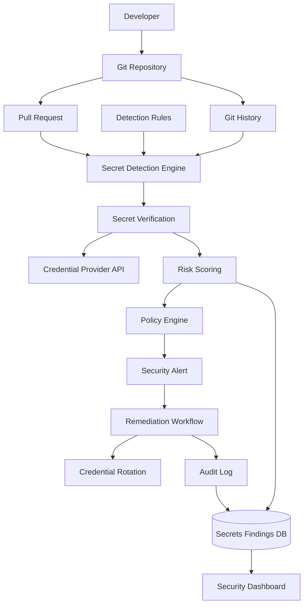
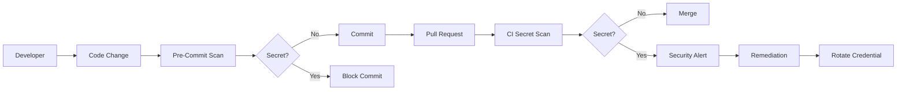
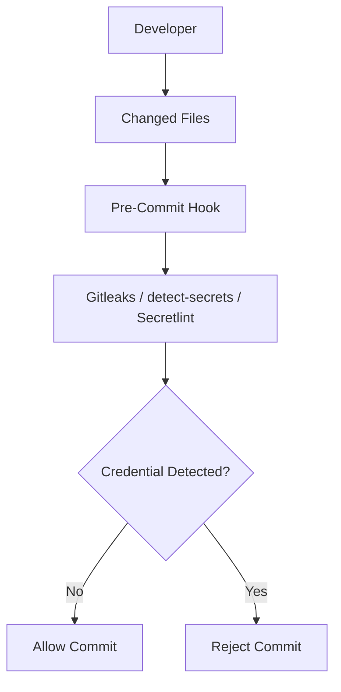
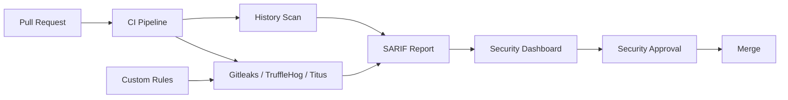
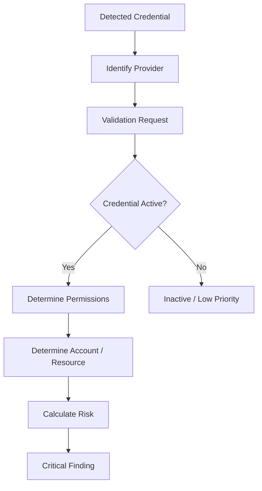
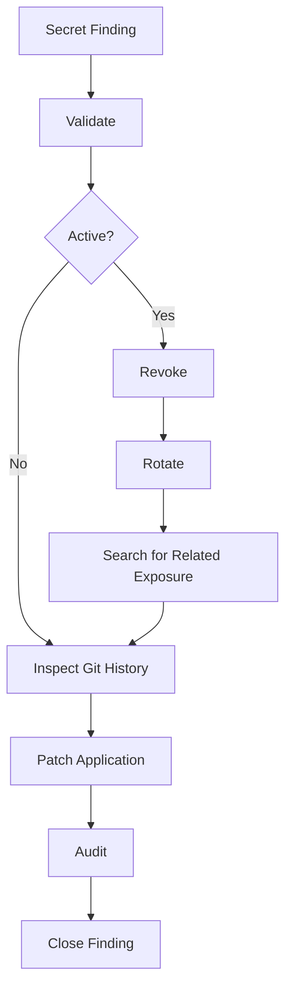
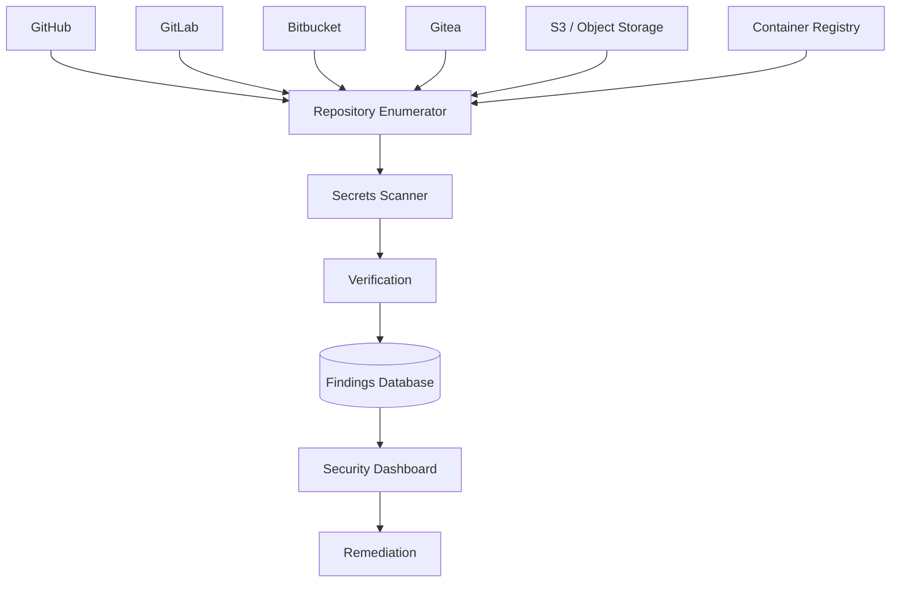

<p align="center">
  
</p>

# Awesome Secrets Detection Platform 🛡️

> **The Definitive Ecosystem Guide to Secrets Detection, Credential Leak Prevention, Secret Scanning, Non-Human Identity (NHI) Security, and ASPM Platforms**
> 
> *A curated, open-source-first directory covering Git history scanning, pre-commit push protection, CI/CD automated gates, live API secret verification, token discovery, repository monitoring, and developer security guardrails.*

<a href="https://github.com/ishandutta2007/Awesome-Awesome-Awesome"></a><a href="https://discord.gg/jc4xtF58Ve"></a> [](#) [](#how-to-contribute) [](LICENSE) <a href="https://github.com/ishandutta2007"></a>

**Keywords:** `secrets-detection` • `secret-scanning` • `credential-leak-prevention` • `api-key-scanner` • `git-history-scanning` • `trufflehog` • `gitleaks` • `gitguardian` • `github-secret-scanning` • `non-human-identities` • `nhi-governance` • `aspm` • `devsecops` • `pre-commit-hooks` • `push-protection` • `token-verification` • `credential-management`

---

## 📌 Executive Overview

**Secrets detection platforms** identify exposed authentication credentials—including API keys, passwords, personal access tokens (PATs), private SSH/PGP keys, cloud IAM credentials (AWS, GCP, Azure), database connection strings, OAuth client secrets, and webhooks—before or after they reach source code repositories, CI/CD pipelines, container registries, and collaboration channels.

Leading platforms include **Trivy, Gitleaks, TruffleHog, GitGuardian, GitHub Secret Scanning, GitLab Secret Detection, Semgrep Secrets, Doppler Secret Scanner, Cycode, Snyk Secrets, Checkmarx Secrets, and Legit Security**.


The modern ecosystem extends well beyond regular-expression matching. Advanced platforms combine:


* repository and Git-history scanning

* entropy analysis

* provider-specific detection

* secret validation

* pre-commit hooks

* CI/CD enforcement

* pull-request protection

* developer remediation

* secret rotation

* public repository monitoring

* organization-wide discovery

* binary and container scanning

* risk scoring

* secret inventory

* centralized alert management


This README places particular emphasis on **open-source alternatives and composable building blocks**.


## Open-source emphasis


Open-source projects are divided into:


1. **Direct secret-scanning alternatives** — projects that can independently scan source code, repositories or Git history for secrets.

2. **Developer protection tools** — pre-commit, commit-time and CI/CD scanners.

3. **Verification-oriented scanners** — tools capable of determining whether discovered credentials are still active.

4. **Repository/history reconnaissance tools** — tools designed to discover secrets across historical commits and repositories.

5. **Security building blocks** — policy engines, CI integrations, SARIF tooling and workflow components that can be combined into a complete secrets-management platform.


> **Important:** Secret detection is only one part of secret security. Finding a credential does not revoke it. Production remediation should normally include **credential revocation/rotation, blast-radius assessment, historical cleanup where appropriate, access review and preventive controls**.


GitHub's own documentation similarly distinguishes detection from remediation and recommends rotating exposed credentials immediately.


Contributions and corrections are welcome.


---


## Table of Contents


* [SaaS/Hosted Platforms](#saashosted-platforms)

* [Open-Source Secrets Detection Projects](#open-source-secrets-detection-projects)

* [Open-Source Git History Scanners](#open-source-git-history-scanners)

* [Open-Source Developer / Pre-Commit Protection](#open-source-developer--pre-commit-protection)

* [Open-Source Secret Verification](#open-source-secret-verification)

* [Open-Source Code Security Platforms with Secret Detection](#open-source-code-security-platforms-with-secret-detection)

* [Secret Detection Rules & Pattern Engines](#secret-detection-rules--pattern-engines)

* [Additional Strong Open-Source Options](#additional-strong-open-source-options)

* [Commercial Platform → Open-Source Equivalents](#commercial-platform--open-source-equivalents)

* [Frameworks for Building Custom Secrets Detection Platforms](#frameworks-for-building-custom-secrets-detection-platforms)

* [Reference Architecture](#reference-architecture)

* [Typical Secret Detection Workflow](#typical-secret-detection-workflow)

* [Pre-Commit Protection Workflow](#pre-commit-protection-workflow)

* [CI/CD Secrets Detection Workflow](#cicd-secrets-detection-workflow)

* [Secret Verification Workflow](#secret-verification-workflow)

* [Remediation Workflow](#remediation-workflow)

* [Capability Matrix](#capability-matrix)

* [Recommended Open-Source Stacks](#recommended-open-source-stacks)

* [What Is Still Difficult to Reproduce in Open Source?](#what-is-still-difficult-to-reproduce-in-open-source)

* [Why Open Source Is Interesting](#why-open-source-is-interesting)

* [How to Contribute](#how-to-contribute)

* [Disclaimer](#disclaimer)


---


# SaaS/Hosted Platforms


These are commercial, hosted or enterprise-oriented secrets detection and credential exposure platforms.


> **Market Size & Industry Dynamics:** The secrets detection and automated credential security sector is currently valued at an estimated **$4.2 Billion** (growing at ~22% CAGR as part of the broader **$25+ Billion** Application Security Testing and ASPM ecosystem). The sector is **moderately to highly fragmented**—moving from point solutions toward integrated DevSecOps platforms, but prevented from becoming a winner-take-all market due to specialized non-human identity (NHI) verification requirements and vigorous open-source innovation.

| Platform | Primary Model | Main Strength | Company Size (Valuation / Revenue) | Pricing | Free Tier / Free Trial Limit |
| --- | --- | --- | --- | --- | --- |
| [GitHub Secret Scanning](https://github.com/security/advanced-security/secret-protection) | GitHub-native | Repository monitoring + push protection | Parent: Microsoft ($3+ Trillion market cap); GitHub ARR $2B+ | Starts at $49/active committer/month (GitHub Advanced Security, billed annually; requires GitHub Enterprise at $21/user/month) | Free plan: 100% free for all public repositories (includes secret scanning, push protection, and validity checks); free push protection on personal private repos; 30-day free trial of GitHub Enterprise |
| [GitLab Secret Detection](https://docs.gitlab.com/user/application_security/secret_detection/) | GitLab-native | Secret detection in DevSecOps | NASDAQ: GTLB (~$7.5 Billion market cap / ~$700M ARR) | Starts at $29/user/month (GitLab Premium, billed annually) or $99/user/month (GitLab Ultimate for Secret Push Protection) | Free plan: includes basic pipeline Secret Detection CI jobs, 5 users per group, 400 compute minutes/month, 10 GiB storage; 30-day free trial for GitLab Ultimate |
| [Spectral](https://spectralops.io/) | Developer security | Secrets + code security | Parent: Check Point (NASDAQ: CHKP, ~$20 Billion market cap; acquired Spectral for $60M) | Starts at $19/contributor/month (Business tier, min. 25 contributors, billed annually) | Free plan: up to 10 contributors, 10 repositories, 30 scans/day, and 1 month data retention |
| [Snyk Secrets](https://snyk.io/) | Developer security | Secrets integrated with Snyk AppSec | $3.1 Billion – $7.4 Billion valuation (~$250M+ ARR) | Starts at $25/month per contributing developer (Team plan) | Free plan: 100 Code (SAST & Secrets) tests/month, 200 Open Source tests/month, 300 IaC tests/month, 100 Container tests/month (unlimited for open-source repos) |
| [Harness STO](https://www.harness.io/products/security-testing-orchestration) | DevSecOps | Security orchestration | $3.7 Billion valuation (~$150M+ ARR) | Starts at $35/developer/month (or $50/developer/month; entry annual plans from $8,500/year) | Free plan: up to 5 users and 500 build minutes/month; 14-day free trial of Enterprise STO with full pipeline orchestration |
| [Checkmarx Secrets](https://checkmarx.com/) | AppSec | Enterprise secrets detection | $1.15 Billion valuation (~$150M+ ARR; Hellman & Friedman) | Starts at $26,400/year (entry annual tier; ~$45–$60/contributor/month in enterprise bundles) | 14-day free trial of Checkmarx One with full scanning engine access (SAST, SCA, Secrets Detection) |
| [Semgrep Secrets](https://semgrep.dev/products/secrets/) | Code security | Context-aware secrets detection | ~$350 Million valuation ($93M funding raised) | Starts at $15/contributor/month for Semgrep Secrets ($30/contributor/month for Teams Code/Supply Chain) | Free Edition: up to 10 contributors, 10 private repositories, unlimited public repositories, and 60 AI credits |
| [Cycode](https://cycode.com/) | ASPM / AppSec | Secrets + SAST + SCA + IaC | ~$300 Million valuation ($80M funding raised) | Starts at $30,000/year (~$2,500/month or ~$300/developer/year for 100 developers) | 14-day free trial with full secrets detection and ASPM platform access; open-source CLI tools (Cimon) are free forever |
| [Apiiro](https://www.apiiro.com/) | ASPM | Risk-based software security | ~$300 Million valuation ($135M funding raised) | Starts at $2/developer/month (Secrets add-on) / $14,082/year base entry tier (median contract $52,061/year) | 14-day free trial / guided Risk Assessment POC with access to Deep ASPM and Secrets detection |
| [Endor Labs](https://www.endorlabs.com/) | Application security | Software supply-chain risk | ~$250 Million valuation ($70M funding raised) | Starts at $27,648/year entry tier (median contract $39,000/year; or ~$25–$35/developer/month) | Developer tier: free forever using AURI CLI/IDE tools with no account required; 30-day free trial of Enterprise Cloud platform |
| [GitGuardian](https://www.gitguardian.com/) | Enterprise secrets detection | Secret detection, monitoring and remediation | ~$200 Million valuation ($56M funding raised; ~$20M ARR) | Starts at $18/developer/month (Business tier, billed annually) | Free plan: up to 25 developers, unlimited real-time scanning, up to 500 historical scan detection, 10K API calls/month, and 1 GB repository scanning capacity; 14-day free trial for Business/Enterprise |
| [Legit Security](https://www.legitsecurity.com/) | ASPM / DevSecOps | Software supply-chain security | ~$180 Million valuation ($68M funding raised) | Starts at $60,000/year for 100 users on AWS Marketplace ($50/user/month or $600/user/year) | 14-day free trial / guided POC with full platform features; open-source CLI tool (Legitify) is free forever |
| [ArmorCode](https://www.armorcode.com/) | ASPM | Centralized application security | ~$160 Million valuation ($40M funding raised) | Starts at $25,000/year (entry annual tier; ~$35–$45/developer/month) | 14-day free trial / guided POC with full platform integrations and secret ingestion |
| [Doppler Secret Scanner](https://www.doppler.com/) | Secret management + scanning | Secret lifecycle + developer workflows | ~$150 Million valuation ($30M funding raised) | Starts at $8/user/month (Developer tier for users beyond 3; Team tier at $21/user/month) | Free plan: up to 3 users, 10 projects, 4 environments/project, 5 config syncs, and 3 days activity logs; 14-day free trial for Team tier |
| [Detectify](https://detectify.com/) | Security platform | External security discovery | ~$120 Million valuation ($42M funding raised) | Starts at €2,500/year (~$2,700/year, up to 10 users, 1 team, billed annually) | Starter plan: €0/year forever (up to 5 users, 1 team, REST & GraphQL API scanning); 14-day free trial for Application Scanning |
| [Aikido Security](https://www.aikido.dev/) | Unified AppSec | Secrets + broader application security | ~$100 Million valuation ($24.5M funding raised) | Starts at $300/month (Basic plan, includes 10 users and 100 repositories; Pro is $600/month) | Developer plan: free forever for 2 users, 10 repositories, 2 container images, 1 domain, 1 cloud account, and 10 AI autofixes/month |
| [Bearer](https://bearer.com/) | Data/code security | Sensitive-data and secret discovery | ~$300 Million parent valuation (Acquired by Cycode) | Starts at $30,000/year (integrated into Cycode ASPM; standalone previously $49/developer/month) | Bearer CLI is 100% free and open-source (Apache 2.0) with unlimited local & CI scans; Bearer Cloud includes a 14-day free trial |
| [TruffleHog](https://trufflesecurity.com/) | Secret detection + verification | High-signal secret verification | ~$60 Million valuation ($9M funding raised) | Starts at $50/developer/month (Enterprise tier, typically from $12,000/year annual contract) | Free plan: 100% free and open-source CLI/engine with unlimited scans and 800+ detectors; 14-day free trial for Enterprise |
| [Gitleaks](https://gitleaks.io/) | Developer / CI scanning | Fast Git secret detection | Bootstrapped / Open Source (~$200K ARR / sponsorships) | $0 (100% free open source; optional GitHub Sponsorship starts at $5/month) | Free plan: 100% free forever under MIT license for unlimited personal repos and scans; free organization license keys provided for org repos |


GitHub Secret Scanning currently supports repository-wide detection, custom patterns, validity checks and push protection; GitHub also operates a partner program that can notify participating secret providers when exposed credentials are detected.


---


# Open-Source Secrets Detection Projects

These are the most important open-source projects to investigate first, ranked by GitHub popularity (star counts descending):

| Rank | Project | Stars | Primary Focus | Best For | License |
| :--- | :--- | :--- | :--- | :--- | :--- |
| 1 | [Trivy](https://github.com/aquasecurity/trivy) [](https://github.com/aquasecurity/trivy/stargazers) | 37.8k+ | Multi-purpose vulnerability, container & secret scanner | All-in-one DevSecOps scanning | Apache-2.0 |
| 2 | [Gitleaks](https://github.com/gitleaks/gitleaks) [](https://github.com/gitleaks/gitleaks/stargazers) | 29.2k+ | Fast Git repository & commit scanning | Pre-commit hooks, CI/CD pipelines, Git history | MIT |
| 3 | [TruffleHog](https://github.com/trufflesecurity/trufflehog) [](https://github.com/trufflesecurity/trufflehog/stargazers) | 27.7k+ | Secret detection & live credential verification | High-signal validation with 800+ detectors | AGPL-3.0 |
| 4 | [Semgrep](https://github.com/semgrep/semgrep) [](https://github.com/semgrep/semgrep/stargazers) | 16.6k+ | Semantic code analysis & contextual secrets | AST-aware secret scanning & guardrails | LGPL-2.1 |
| 5 | [git-secrets](https://github.com/awslabs/git-secrets) [](https://github.com/awslabs/git-secrets/stargazers) | 13.4k+ | Commit-time AWS & credential prevention | Preventing accidental credential commits to Git | Apache-2.0 |
| 6 | [Gitrob](https://github.com/michenriksen/gitrob) [](https://github.com/michenriksen/gitrob/stargazers) | 6.2k+ | GitHub organization reconnaissance | Security auditing & OSINT repository reconnaissance | MIT |
| 7 | [detect-secrets](https://github.com/Yelp/detect-secrets) [](https://github.com/Yelp/detect-secrets/stargazers) | 4.6k+ | Enterprise baseline-managed scanning | Enterprise legacy repos & baseline diffs | Apache-2.0 |
| 8 | [shhgit](https://github.com/eth0izzle/shhgit) [](https://github.com/eth0izzle/shhgit/stargazers) | 4.0k+ | Real-time public GitHub/GitLab scanner | Monitoring public commit streams in real time | MIT |
| 9 | [Nosey Parker](https://github.com/praetorian-inc/noseyparker) [](https://github.com/praetorian-inc/noseyparker/stargazers) | 2.3k+ | Ultra-high performance textual & Git scanner | Multi-gigabyte repository history scanning | Apache-2.0 |
| 10 | [ggshield](https://github.com/GitGuardian/ggshield) [](https://github.com/GitGuardian/ggshield/stargazers) | 2.0k+ | Developer CLI & pre-commit secrets engine | 500+ secret detectors, pre-commit & CI/CD | MIT |
| 11 | [git-hound](https://github.com/tillson/git-hound) [](https://github.com/tillson/git-hound/stargazers) | 1.5k+ | GitHub dorks & repository reconnaissance | Organization-wide secrets discovery across GitHub | MIT |
| 12 | [Secretlint](https://github.com/secretlint/secretlint) [](https://github.com/secretlint/secretlint/stargazers) | 1.4k+ | Pluggable linting framework for credentials | JS/TS ecosystems, npm/monorepos, pre-commit | MIT |
| 13 | [git-all-secrets](https://github.com/anshumanbh/git-all-secrets) [](https://github.com/anshumanbh/git-all-secrets/stargazers) | 1.1k+ | Multi-scanner Git secret aggregator | Aggregating multiple Git scanning engines | MIT |
| 14 | [DumpsterDiver](https://github.com/securing/DumpsterDiver) [](https://github.com/securing/DumpsterDiver/stargazers) | 1.0k+ | Deep analysis of big data pools & files | Auditing archives, compressed files & memory dumps | MIT |
| 15 | [Earlybird](https://github.com/americanexpress/earlybird) [](https://github.com/americanexpress/earlybird/stargazers) | 770+ | Sensitive data, PII & crypto detection | Enterprise source code auditing and compliance | Apache-2.0 |
| 16 | [Titus](https://github.com/praetorian-inc/titus) [](https://github.com/praetorian-inc/titus/stargazers) | 690+ | High-speed scanning with live validation | 480+ detectors with verification, Burp & Chrome extensions | Apache-2.0 |
| 17 | [repo-supervisor](https://github.com/auth0/repo-supervisor) [](https://github.com/auth0/repo-supervisor/stargazers) | 650+ | AWS Lambda / local code scanner | Serverless repo scanning and CI integration | MIT |
| 18 | [rusty-hog](https://github.com/newrelic/rusty-hog) [](https://github.com/newrelic/rusty-hog/stargazers) | 550+ | High-performance Rust regex secret scanning | Multi-threaded Git, Jira, Slack & Confluence scanning | Apache-2.0 |
| 19 | [Whispers](https://github.com/Skyscanner/whispers) [](https://github.com/Skyscanner/whispers/stargazers) | 500+ | Static structured text secrets identification | Auditing JSON, YAML, XML, and config files | Apache-2.0 |
| 20 | [credential-digger](https://github.com/SAP/credential-digger) [](https://github.com/SAP/credential-digger/stargazers) | 360+ | ML-assisted false positive reduction | Git history scanning with ML noise filtering | Apache-2.0 |
| 21 | [Cycode CLI](https://github.com/cycodehq/cycode-cli) [](https://github.com/cycodehq/cycode-cli/stargazers) | 100+ | Multi-vector developer security scanner | Combined Secrets, SAST, SCA, and IaC scanning | Apache-2.0 |

---


## 1. Trivy [](https://github.com/aquasecurity/trivy/stargazers)

[GitHub](https://github.com/aquasecurity/trivy)

Trivy by Aqua Security is a comprehensive, open-source security scanner that detects vulnerabilities (CVEs), IaC misconfigurations, sensitive data, and exposed secrets across Git repositories, container images, filesystems, and Kubernetes clusters.

Its built-in secret scanning engine checks against extensive regular expression rules for cloud credentials, API tokens, and private keys during pre-commit, CI/CD pipelines, and runtime container inspections.

---

## 2. Gitleaks [](https://github.com/gitleaks/gitleaks/stargazers)

[GitHub](https://github.com/gitleaks/gitleaks)


Gitleaks is one of the strongest general-purpose open-source secrets scanners.


It can be used as:


* CLI

* GitHub Action

* pre-commit hook

* CI/CD scanner

* repository scanner

* Git-history scanner


Typical targets include:


```text

API keys

Passwords

Tokens

Private keys

Cloud credentials

Database credentials

OAuth credentials

Service credentials

```


Gitleaks describes itself as a SAST-style tool for detecting and preventing hardcoded secrets in Git repositories and supports CLI, GitHub Actions, pre-commit and CI/CD workflows.


### Typical workflow


```text

Developer

    ↓

Git Commit

    ↓

Gitleaks

    ↓

Secret?

 ┌──┴──┐

No    Yes

 │      │

 ↓      ↓

Commit  Block

```


---


## 3. TruffleHog [](https://github.com/trufflesecurity/trufflehog/stargazers)

[GitHub](https://github.com/trufflesecurity/trufflehog)


TruffleHog is one of the strongest open-source options when **secret verification** is important.


It supports scanning sources including:


* Git repositories

* GitHub organizations

* GitLab

* filesystems

* S3

* GCS

* Docker images

* CI/CD systems

* other data sources


TruffleHog can distinguish verified and unverified findings and supports scanning Git history.


The project is currently released under AGPL-3.0.


### Why TruffleHog is important


A scanner can produce:


```text

Potential AWS key

```


A verification-oriented scanner can attempt to determine:


```text

Potential AWS key

        ↓

Is credential valid?

        ↓

YES

        ↓

High-priority finding

```


This can dramatically reduce remediation noise.


---


## 4. git-secrets [](https://github.com/awslabs/git-secrets/stargazers)

[GitHub](https://github.com/awslabs/git-secrets)

AWS's `git-secrets` is a lightweight prevention-oriented tool.

It installs Git hooks and scans:

* commits
* commit messages
* merge histories
* repository files
* Git history

It supports custom prohibited patterns and allow patterns, plus AWS-specific credential checks.

Typical model:

```text
git commit
     ↓
pre-commit hook
     ↓
git-secrets
     ↓
Pattern match?
  ┌──┴──┐
 No    Yes
  │      │
  ↓      ↓
Allow   Block
```

---

## 5. detect-secrets [](https://github.com/Yelp/detect-secrets/stargazers)

[GitHub](https://github.com/Yelp/detect-secrets)

Yelp's `detect-secrets` is designed around preventing **new secrets from entering a codebase** while allowing organizations to maintain a baseline for existing findings.

This is particularly useful for legacy repositories.

Core concepts:

```text
Existing Secrets
      ↓
Baseline
      ↓
Ignore / Track

New Secrets
      ↓
Detect
      ↓
Block
```

The project explicitly supports baseline-based workflows so organizations can prevent new secrets while separately working through legacy exposure.


---


## 6. Secretlint [](https://github.com/secretlint/secretlint/stargazers)

[GitHub](https://github.com/secretlint/secretlint)

Secretlint is a pluggable credential-linting framework.

Features include:

* project-level configuration
* custom rules
* pre-commit integration
* CI integration
* multiple output formats
* SARIF support
* Docker
* browser extension

It is especially attractive for JavaScript/TypeScript-heavy environments where teams want an ESLint-like developer experience for secrets.

---

## 7. Titus [](https://github.com/praetorian-inc/titus/stargazers)

[GitHub](https://github.com/praetorian-inc/titus)


Titus is a newer high-performance open-source secrets scanner from Praetorian.


It is particularly interesting because it combines:


* high-speed scanning

* Git history scanning

* live credential validation

* risk scoring

* container/OCI image scanning

* binary extraction

* Go library

* Burp Suite integration

* browser extension


The project currently documents hundreds of detection rules and live credential validation.


Titus is the successor to **Nosey Parker**, which has been officially retired in favor of Titus.


---


# Open-Source Git History Scanners


Historical scanning is critical because deleting a secret from the latest commit does not necessarily remove it from Git history.


```text

Current Code

     │

     ├── Current files

     │

     └── Git history

            │

            ├── Commit -1

            ├── Commit -2

            ├── Commit -3

            └── Deleted secrets

```


Important projects include (ranked by stars descending):

* [Gitleaks](https://github.com/gitleaks/gitleaks) [](https://github.com/gitleaks/gitleaks/stargazers)
* [TruffleHog](https://github.com/trufflesecurity/trufflehog) [](https://github.com/trufflesecurity/trufflehog/stargazers)
* [git-secrets](https://github.com/awslabs/git-secrets) [](https://github.com/awslabs/git-secrets/stargazers)
* [detect-secrets](https://github.com/Yelp/detect-secrets) [](https://github.com/Yelp/detect-secrets/stargazers)
* [Nosey Parker](https://github.com/praetorian-inc/noseyparker) [](https://github.com/praetorian-inc/noseyparker/stargazers)
* [Secretlint](https://github.com/secretlint/secretlint) [](https://github.com/secretlint/secretlint/stargazers)
* [Titus](https://github.com/praetorian-inc/titus) [](https://github.com/praetorian-inc/titus/stargazers)


---


# Open-Source Developer / Pre-Commit Protection


The strongest open-source developer-side controls include:


| Project        | Pre-Commit |       Git History | CI/CD | Custom Rules |

| -------------- | ---------: | ----------------: | ----: | -----------: |

| Gitleaks       |          ✅ |                 ✅ |     ✅ |            ✅ |

| TruffleHog     |       ✅/CI |                 ✅ |     ✅ |            ✅ |

| detect-secrets |          ✅ | Baseline-oriented |     ✅ |            ✅ |

| git-secrets    |          ✅ |                 ✅ |    ⚠️ |            ✅ |

| Secretlint     |          ✅ |           Limited |     ✅ |            ✅ |

| Titus          |       ✅/CI |                 ✅ |     ✅ |            ✅ |


A strong defense-in-depth approach is:


```text

Developer Machine

       ↓

Pre-commit

       ↓

CI Pull Request

       ↓

Repository Scan

       ↓

Periodic History Scan

       ↓

Production Monitoring

```


---


# Open-Source Secret Verification


Detection and verification are different.


## Detection


```text

Looks like AWS credential

```


## Verification


```text

Looks like AWS credential

          ↓

Credential API check

          ↓

Credential active?

      ┌───┴───┐

     Yes      No

      ↓        ↓

   Critical   Lower priority

```


Important verification-capable projects include (ranked by stars descending):

* [TruffleHog](https://github.com/trufflesecurity/trufflehog) [](https://github.com/trufflesecurity/trufflehog/stargazers)
* [ggshield](https://github.com/GitGuardian/ggshield) [](https://github.com/GitGuardian/ggshield/stargazers)
* [Titus](https://github.com/praetorian-inc/titus) [](https://github.com/praetorian-inc/titus/stargazers)


GitHub Secret Scanning also supports validity checks for supported secrets, allowing organizations to prioritize credentials that remain active.


> **Security warning:** Secret verification requires network/API access to the credential provider. A production implementation should carefully control outbound requests, rate limits, credential handling and logging.


---


# Open-Source Code Security Platforms with Secret Detection


Secrets detection increasingly appears inside broader open-source application-security platforms.


## Semgrep [](https://github.com/semgrep/semgrep/stargazers)

[GitHub](https://github.com/semgrep/semgrep)

Semgrep is an open-source static analysis engine that can be used for code security and secret-related rules.

It supports:

* IDE
* pre-commit
* CI/CD
* custom rules
* semantic code matching
* security guardrails

However, Semgrep's own documentation distinguishes the capabilities of the open-source Community Edition from the broader commercial AppSec platform.

---

## Cycode CLI [](https://github.com/cycodehq/cycode-cli/stargazers)

[GitHub](https://github.com/cycodehq/cycode-cli)


The Cycode CLI provides multiple scan modes including:


```text

secret

iac

sca

sast

```


It is useful as a developer-facing CLI component, although Cycode's full platform is commercial.


---


# Secret Detection Rules & Pattern Engines


A modern scanner typically combines several detection techniques.


## 1. Regular Expressions


Example:


```text

AKIA[0-9A-Z]{16}

```


Useful for provider-specific formats.


---


## 2. Entropy Analysis


High-entropy strings can indicate:


```text

API tokens

encryption keys

random credentials

session tokens

private material

```


But entropy alone creates many false positives.


---


## 3. Contextual Detection


Instead of:


```text

[a-zA-Z0-9]{32}

```


a scanner can look for:


```text

AWS_SECRET_ACCESS_KEY = <candidate>

```


---


## 4. Provider-Specific Verification


```text

Detected token

      ↓

Provider API

      ↓

Valid?

      ↓

Permissions?

      ↓

Account?

      ↓

Risk

```


---


## 5. Semantic / AI Detection


AI-assisted secret detection can attempt to find credentials that do not match known token formats.


GitHub now documents AI-detected secrets as an extension of its generic secret detection capabilities.


---


# Additional Strong Open-Source Options


## High-Value Projects

* [Trivy](https://github.com/aquasecurity/trivy) [](https://github.com/aquasecurity/trivy/stargazers) — multi-target vulnerability, container, IaC, and secret scanner
* [Gitleaks](https://github.com/gitleaks/gitleaks) [](https://github.com/gitleaks/gitleaks/stargazers) — SAST-style Git secret scanner and pre-commit hook
* [TruffleHog](https://github.com/trufflesecurity/trufflehog) [](https://github.com/trufflesecurity/trufflehog/stargazers) — active secret verification engine with 800+ detectors
* [Semgrep](https://github.com/semgrep/semgrep) [](https://github.com/semgrep/semgrep/stargazers) — AST and semantic pattern matching engine for code and secrets
* [git-secrets](https://github.com/awslabs/git-secrets) [](https://github.com/awslabs/git-secrets/stargazers) — AWS and credential commit blocker
* [detect-secrets](https://github.com/Yelp/detect-secrets) [](https://github.com/Yelp/detect-secrets/stargazers) — baseline-driven enterprise credential scanner
* [ggshield](https://github.com/GitGuardian/ggshield) [](https://github.com/GitGuardian/ggshield/stargazers) — developer CLI with 500+ secret detectors and CI integrations
* [Secretlint](https://github.com/secretlint/secretlint) [](https://github.com/secretlint/secretlint/stargazers) — pluggable credential linter for JavaScript/TypeScript and multi-language repositories
* [Titus](https://github.com/praetorian-inc/titus) [](https://github.com/praetorian-inc/titus/stargazers) — high-speed secrets scanner with live validation (Burp & Chrome extensions)
* [Whispers](https://github.com/Skyscanner/whispers) [](https://github.com/Skyscanner/whispers/stargazers) — structured text and configuration secrets identification
* [credential-digger](https://github.com/SAP/credential-digger) [](https://github.com/SAP/credential-digger/stargazers) — ML-assisted false-positive filtering Git secret scanner
* [Cycode CLI](https://github.com/cycodehq/cycode-cli) [](https://github.com/cycodehq/cycode-cli/stargazers) — multi-vector developer CLI (Secrets, SAST, SCA, IaC)

## Historical / Related Reconnaissance Projects

* [Gitrob](https://github.com/michenriksen/gitrob) [](https://github.com/michenriksen/gitrob/stargazers) — historical GitHub repository reconnaissance tool
* [shhgit](https://github.com/eth0izzle/shhgit) [](https://github.com/eth0izzle/shhgit/stargazers) — real-time public GitHub/GitLab commit stream secret monitor
* [Nosey Parker](https://github.com/praetorian-inc/noseyparker) [](https://github.com/praetorian-inc/noseyparker/stargazers) — retired; high-speed textual and Git history scanner (superseded by Titus)
* [git-hound](https://github.com/tillson/git-hound) [](https://github.com/tillson/git-hound/stargazers) — GitHub dorks & public secret reconnaissance
* [git-all-secrets](https://github.com/anshumanbh/git-all-secrets) [](https://github.com/anshumanbh/git-all-secrets/stargazers) — multi-scanner Git secret aggregator
* [DumpsterDiver](https://github.com/securing/DumpsterDiver) [](https://github.com/securing/DumpsterDiver/stargazers) — searches secrets across file types and compressed archives
* [Earlybird](https://github.com/americanexpress/earlybird) [](https://github.com/americanexpress/earlybird/stargazers) — enterprise sensitive data and secret detection
* [repo-supervisor](https://github.com/auth0/repo-supervisor) [](https://github.com/auth0/repo-supervisor/stargazers) — serverless AWS Lambda and local secret scanner
* [rusty-hog](https://github.com/newrelic/rusty-hog) [](https://github.com/newrelic/rusty-hog/stargazers) — Rust-based high performance secret scanners (Git, Jira, Slack, Confluence)
* [truffleHog legacy](https://github.com/dxa4481/truffleHog) [](https://github.com/dxa4481/truffleHog/stargazers) — historical Python predecessor to modern Go TruffleHog


## Secret-Scanning Ecosystem / Supporting Tools


* [pre-commit](https://github.com/pre-commit/pre-commit)

* [GitHub Actions](https://github.com/features/actions)

* [GitLab CI/CD](https://gitlab.com/)

* [Jenkins](https://github.com/jenkinsci/jenkins)

* [Tekton](https://github.com/tektoncd/pipeline)

* [Argo Workflows](https://github.com/argoproj/argo-workflows)

* [Open Policy Agent](https://github.com/open-policy-agent/opa)

* [Kyverno](https://github.com/kyverno/kyverno)

* [DefectDojo](https://github.com/DefectDojo/django-DefectDojo)

* [OWASP Dependency-Check](https://github.com/jeremylong/DependencyCheck)

* [SARIF](https://sarifweb.azurewebsites.net/)


---


# Commercial Platform → Open-Source Equivalents


| Commercial / Hosted Platform    | Closest Open-Source Options                    | Notes                                 |

| ------------------------------- | ---------------------------------------------- | ------------------------------------- |

| **GitGuardian**                 | Gitleaks + TruffleHog + detect-secrets + Titus | Strong DIY combination                |

| **Spectral**                    | Gitleaks + Secretlint + Semgrep                | Developer-centric security            |

| **TruffleHog Enterprise**       | TruffleHog OSS + Titus + Gitleaks              | Open-source core capabilities         |

| **Gitleaks**                    | Gitleaks                                       | Direct open-source project            |

| **Doppler Secret Scanner**      | Gitleaks + detect-secrets + git-secrets        | Scanning plus external secret manager |

| **Cycode**                      | Gitleaks + Semgrep + TruffleHog + OPA          | Assemble broader AppSec               |

| **Legit Security**              | Gitleaks + Semgrep + DefectDojo + OPA          | DIY DevSecOps platform                |

| **Checkmarx Secrets**           | Gitleaks + TruffleHog + detect-secrets         | Strong scanning combination           |

| **Snyk Secrets**                | Gitleaks + Semgrep + TruffleHog                | Developer-security alternative        |

| **GitHub Secret Scanning**      | Gitleaks + TruffleHog + Titus                  | Strong open-source Git scanning stack |

| **GitLab Secret Detection**     | Gitleaks + detect-secrets                      | CI/CD-oriented                        |

| **Semgrep Secrets**             | Semgrep + Gitleaks + Secretlint                | Contextual + regex approaches         |

| **Nosey Parker**                | Titus                                          | Titus is its successor                |

| **AWS git-secrets**             | git-secrets                                    | Direct open-source alternative        |

| **Secretlint**                  | Secretlint                                     | Direct open-source project            |

| **Enterprise secret inventory** | TruffleHog + Gitleaks + PostgreSQL + Grafana   | Custom platform required              |

| **Secret verification**         | TruffleHog + Titus                             | Strong OSS choices                    |

| **Secret remediation**          | Scanner + provider APIs + workflow engine      | Usually custom automation             |


---


# Frameworks for Building Custom Secrets Detection Platforms


A complete open-source secrets security platform can be assembled from several layers.


## Detection Engine


Choose one or more:


```text

Gitleaks

TruffleHog

Titus

detect-secrets

Secretlint

Semgrep

git-secrets

```


---


## Rule Engine


```text

Regex

Entropy

Provider patterns

Context rules

YAML rules

Custom organizational patterns

```


---


## Repository Enumeration


```text

GitHub API

GitLab API

Bitbucket API

Gitea API

Local Git

Git mirrors

Container registries

Object storage

```


---


## Verification


```text

Provider API

     ↓

Credential validity

     ↓

Identity

     ↓

Permissions

     ↓

Blast radius

     ↓

Risk score

```


---


## Policy Engine


Use:


* [Open Policy Agent](https://github.com/open-policy-agent/opa)

* [Kyverno](https://github.com/kyverno/kyverno)


Example policy:


```text

IF secret detected

AND repository = production

AND credential = active

THEN severity = CRITICAL

AND block deployment

```


---


## Identity


Use:


* [Keycloak](https://github.com/keycloak/keycloak)

* [Authentik](https://github.com/goauthentik/authentik)

* [OpenFGA](https://github.com/openfga/openfga)


---


## Workflow Automation


Use:


* [Temporal](https://github.com/temporalio/temporal)

* [Apache Airflow](https://github.com/apache/airflow)

* [Dagster](https://github.com/dagster-io/dagster)

* [Prefect](https://github.com/PrefectHQ/prefect)

* [n8n](https://github.com/n8n-io/n8n)

* [Node-RED](https://github.com/node-red/node-red)


---


## Storage


```text

PostgreSQL

     +

Object Storage

     +

Redis

```


Possible open-source components:


* [PostgreSQL](https://github.com/postgres/postgres)

* [MinIO](https://github.com/minio/minio)

* [Redis](https://github.com/redis/redis)


---


## Search


For large secret inventories:


* [OpenSearch](https://github.com/opensearch-project/OpenSearch)

* [Elasticsearch](https://github.com/elastic/elasticsearch)

* [Apache Solr](https://github.com/apache/solr)


---


## Visualization


* [Grafana](https://github.com/grafana/grafana)

* [Metabase](https://github.com/metabase/metabase)

* [Apache Superset](https://github.com/apache/superset)


---


# Reference Architecture





---


# Typical Secret Detection Workflow





---


# Pre-Commit Protection Workflow





This is one of the cheapest and most effective points at which to prevent accidental credential exposure.


---


# CI/CD Secrets Detection Workflow





---


# Secret Verification Workflow





---


# Remediation Workflow


Finding a secret is not the end of the process.





---


# Secret Exposure Lifecycle


```text

Developer

    ↓

Secret Created

    ↓

Secret Used

    ↓

Accidental Exposure

    ↓

Detection

    ↓

Validation

    ↓

Risk Assessment

    ↓

Revocation

    ↓

Rotation

    ↓

Historical Cleanup

    ↓

Root-Cause Analysis

    ↓

Preventive Control

```


---


# Types of Secrets


A mature scanner should ideally recognize multiple categories.


## Cloud Credentials


```text

AWS

Azure

GCP

OCI

Cloudflare

DigitalOcean

```


## SaaS Tokens


```text

GitHub

GitLab

Slack

Datadog

Stripe

Twilio

SendGrid

Sentry

PagerDuty

```


## Database Credentials


```text

PostgreSQL

MySQL

MongoDB

Redis

Elasticsearch

Oracle

SQL Server

```


## Private Keys


```text

RSA

ECDSA

Ed25519

SSH

PGP

TLS

```


## Application Credentials


```text

JWT secrets

OAuth secrets

API keys

Webhook secrets

Basic authentication

Connection strings

```


---


# Secret Detection Locations


A modern secrets platform should ideally inspect multiple surfaces.


```text

Source Code

    │

    ├── Git repositories

    ├── Git history

    ├── Pull requests

    ├── Issues

    ├── Wikis

    ├── CI/CD configuration

    ├── Dockerfiles

    ├── Container images

    ├── Infrastructure-as-Code

    ├── Configuration files

    ├── Documentation

    ├── Binary files

    ├── Archives

    └── Package artifacts

```


GitHub Secret Scanning, for example, can scan repository Git history and also covers additional GitHub content such as issues, pull requests, discussions, wikis and secret gists in applicable configurations.


---


# Secret Detection in Containers


Secrets frequently survive inside old container layers.


```text

Dockerfile

    ↓

Build

    ↓

Layer 1

Layer 2

Layer 3

Layer 4

    ↓

Final Image

```


Deleting a secret from the latest layer does not necessarily guarantee that it is absent from earlier layers.


Useful open-source tools include:


* [Titus](https://github.com/praetorian-inc/titus)

* [TruffleHog](https://github.com/trufflesecurity/trufflehog)

* [Gitleaks](https://github.com/gitleaks/gitleaks)

* [Trivy](https://github.com/aquasecurity/trivy)


A comprehensive implementation should scan:


```text

Dockerfile

+

Build Context

+

Image Layers

+

Final Image

+

Registry Artifacts

```


---


# SARIF Integration


SARIF allows secret findings to integrate with security platforms.


```text

Secret Scanner

      ↓

   SARIF

      ↓

GitHub Security

GitLab Security

DefectDojo

Custom Dashboard

```


This is particularly useful for:


* Gitleaks

* Titus

* Semgrep

* custom scanners


---


# Baseline Management


Large legacy repositories may already contain hundreds of findings.


A practical migration strategy is:


```text

Existing Findings

       ↓

Baseline

       ↓

Accept / Remediate

       ↓

Prevent New Secrets

       ↓

Gradually Reduce Baseline

```


This is a major strength of `detect-secrets`.


```text

baseline.json

     ↓

Known Findings

     ↓

New Scan

     ↓

Compare

     ↓

New Secret?

```


---


# False Positive Management


Secret detection inevitably creates false positives.


Common examples:


```text

Example API keys

Test credentials

Documentation samples

Fixture data

Fake JWTs

Hash values

Random IDs

Checksums

Public identifiers

```


A mature scanner should support:


```text

Allowlist

Suppression

Baseline

Inline ignore

Rule-specific exclusions

Path exclusions

Provider-aware validation

```


The objective should not be:


> "Find everything that looks random."


The objective should be:


> **"Find credentials that are likely to provide real access."**


---


# Risk Scoring


A custom platform can calculate:


```text

Risk =

Credential Validity

×

Repository Exposure

×

Credential Privileges

×

Environment Criticality

×

Blast Radius

```


Example:


```text

ACTIVE AWS ROOT CREDENTIAL

+

PUBLIC REPOSITORY

+

PRODUCTION ACCOUNT

+

ADMIN PRIVILEGES


        ↓


CRITICAL

```


Compared with:


```text

Expired Test Token

+

Private Repository

+

No Production Access


        ↓


LOW

```


---


# Capability Matrix


| Capability                 |        GitGuardian | TruffleHog |           Gitleaks | detect-secrets |   Titus | Secretlint | GitHub Secret Scanning |

| -------------------------- | -----------------: | ---------: | -----------------: | -------------: | ------: | ---------: | ---------------------: |

| Secret detection           |                  ✅ |          ✅ |                  ✅ |              ✅ |       ✅ |          ✅ |                      ✅ |

| Git history                |                  ✅ |          ✅ |                  ✅ |              ✅ |       ✅ |         ⚠️ |                      ✅ |

| Pre-commit                 |                  ✅ |         ⚠️ |                  ✅ |              ✅ |      ⚠️ |          ✅ |                     ⚠️ |

| CI/CD                      |                  ✅ |          ✅ |                  ✅ |              ✅ |       ✅ |          ✅ |                      ✅ |

| Custom rules               |                  ✅ |          ✅ |                  ✅ |              ✅ |       ✅ |          ✅ |                      ✅ |

| Entropy detection          |                  ✅ |          ✅ |                  ✅ |              ✅ |      ⚠️ |         ⚠️ |                     ⚠️ |

| Provider-specific patterns |                  ✅ |          ✅ |                  ✅ |              ✅ |       ✅ |          ✅ |                      ✅ |

| Live verification          |                  ✅ |          ✅ |                  ❌ |              ❌ |       ✅ |          ❌ |                     ✅* |

| Risk scoring               |                  ✅ |          ✅ |            Limited |        Limited |       ✅ |    Limited |                      ✅ |

| Repository monitoring      |                  ✅ |          ✅ |            Limited |              ❌ |       ✅ |          ❌ |                      ✅ |

| Organization-wide scan     |                  ✅ |          ✅ |            Limited |              ❌ |       ✅ |          ❌ |                      ✅ |

| Push blocking              |                  ✅ |     Via CI |                  ✅ |   Via hooks/CI |  Via CI |          ✅ |                      ✅ |

| Public monitoring          |                  ✅ |    Partial |                  ❌ |              ❌ | Partial |          ❌ |                     ✅* |

| Binary scanning            |            Limited |          ✅ |            Limited |        Limited |       ✅ |    Limited |                Limited |

| Container scanning         |            Limited |          ✅ |            Limited |              ❌ |       ✅ |          ❌ |                Limited |

| Secret inventory           |                  ✅ |    Partial |                  ❌ |       Baseline | Partial |          ❌ |                      ✅ |

| Central dashboard          |                  ✅ | Commercial |                  ❌ |              ❌ |       ❌ |          ❌ |                      ✅ |

| SaaS                       |                  ✅ |          ✅ | Commercial options |              ❌ |       ❌ |          ❌ |                      ✅ |

| Self-hosted                | Enterprise options |        OSS |                OSS |            OSS |     OSS |        OSS |                   GHES |

| Open source                |     CLI components |          ✅ |       Core scanner |              ✅ |       ✅ |          ✅ |                      ❌ |


`*` Capabilities vary by GitHub plan, repository type and enabled features. GitHub documents push protection, validity checks and public monitoring separately.


---


# Recommended Open-Source Stacks


## 1. Best Overall Open-Source Stack


```text

Gitleaks

    +

TruffleHog

    +

Titus

    +

detect-secrets

    +

GitHub Actions

    +

DefectDojo

```


Why?


```text

Gitleaks

    ↓

Fast baseline scanning


TruffleHog

    ↓

Verification


Titus

    ↓

High-performance detection + validation


detect-secrets

    ↓

Baseline management


DefectDojo

    ↓

Centralized findings

```


---


# 2. Lightweight Developer Stack


```text

Gitleaks

    +

pre-commit

    +

GitHub Actions

```


Excellent for small and medium teams.


---


# 3. Enterprise Open-Source Stack


```text

Gitleaks

       +

TruffleHog

       +

Titus

       +

detect-secrets

       +

DefectDojo

       +

PostgreSQL

       +

OpenSearch

       +

Grafana

       +

Keycloak

       +

OPA

       +

Temporal

```


This can provide:


* centralized findings

* RBAC

* policy enforcement

* verification

* workflow automation

* dashboards

* audit

* remediation tracking


---


# 4. High-Signal Verification Stack


```text

Titus

   +

TruffleHog

   +

Provider APIs

   +

Risk Engine

```


This is particularly useful when the security team receives too many false positives.


---


# 5. GitHub-Centric Open-Source Stack


```text

Gitleaks

    +

GitHub Actions

    +

Titus

    +

TruffleHog

    +

SARIF

```


Example flow:


```text

Pull Request

      ↓

Gitleaks

      ↓

Titus

      ↓

TruffleHog

      ↓

SARIF

      ↓

GitHub Security

```


---


# 6. JavaScript / TypeScript Stack


```text

Secretlint

     +

Gitleaks

     +

pre-commit

     +

GitHub Actions

```


Secretlint is particularly attractive when custom developer-facing rules are important.


---


# 7. Legacy Repository Stack


```text

detect-secrets

      +

Gitleaks

      +

TruffleHog

```


Workflow:


```text

Legacy Findings

      ↓

detect-secrets Baseline

      ↓

Gitleaks New Findings

      ↓

TruffleHog Verification

      ↓

Prioritize Active Credentials

```


---


# 8. Maximum Detection Coverage Stack


```text

Gitleaks

    +

TruffleHog

    +

Titus

    +

detect-secrets

    +

Secretlint

    +

Semgrep

```


This provides multiple detection methodologies rather than relying on one scanner.


However:


> Running six scanners does not automatically mean six times better security.


It can also create duplicate findings and increased triage workload.


A normalization/deduplication layer is therefore recommended.


---


# Example Custom Platform Repository


```text

secrets-platform/

│

├── scanners/

│   ├── gitleaks/

│   ├── trufflehog/

│   ├── titus/

│   └── detect-secrets/

│

├── rules/

│   ├── aws.yaml

│   ├── github.yaml

│   ├── gcp.yaml

│   ├── azure.yaml

│   └── custom.yaml

│

├── verification/

│   ├── aws/

│   ├── github/

│   ├── gcp/

│   └── stripe/

│

├── policy/

│   ├── severity.rego

│   └── production.rego

│

├── workflows/

│   ├── scan.yaml

│   ├── verify.yaml

│   └── remediate.yaml

│

├── api/

│   └── findings/

│

├── database/

│   └── schema.sql

│

├── dashboard/

│

└── README.md

```


---


# Example Findings Database


```sql

CREATE TABLE secret_findings (

    id              UUID PRIMARY KEY,

    repository      TEXT,

    commit_sha      TEXT,

    file_path       TEXT,

    line_number     INTEGER,

    detector        TEXT,

    secret_type     TEXT,

    fingerprint     TEXT,

    validity        TEXT,

    severity        TEXT,

    repository_visibility TEXT,

    first_seen      TIMESTAMP,

    last_seen       TIMESTAMP,

    status          TEXT,

    remediation     TEXT

);

```


Potential status values:


```text

OPEN

VALIDATED

FALSE_POSITIVE

ROTATED

REVOKED

REMEDIATED

ACCEPTED_RISK

```


---


# Secret Fingerprinting


The actual credential should **not** be stored unnecessarily.


Instead:


```text

Raw Secret

    ↓

HMAC / Fingerprint

    ↓

Stable Finding ID

```


Example:


```text

Secret:

sk_live_xxxxxxxxxxxxx


Fingerprint:

sha256/HMAC(...)

```


This allows duplicate findings to be correlated without unnecessarily storing the credential itself.


---


# Secret Deduplication


Multiple scanners may detect the same credential:


```text

Gitleaks ──────┐

TruffleHog ────┤

Titus ─────────┤

detect-secrets ┤

               ↓

        Deduplication Engine

               ↓

          Single Finding

```


Useful deduplication keys can include:


```text

Secret fingerprint

Repository

Commit

File

Line

Secret type

Provider

```


---


# Organization-Wide Secret Monitoring





This architecture approximates the organization-wide discovery capabilities found in enterprise secret-security platforms.


---


# What Is Still Difficult to Reproduce in Open Source?


Even with Gitleaks, TruffleHog, Titus, detect-secrets and related projects, several capabilities remain difficult to reproduce as one unified platform.


## 1. Massive Secret Intelligence


Enterprise platforms may maintain extensive knowledge of:


```text

Provider

Token format

Token version

Validity API

Revocation API

Credential semantics

Account ownership

Permission model

Risk

```


Maintaining this continuously across thousands of services is difficult.


---


## 2. Real-Time Public Monitoring


Scanning your own repositories is relatively straightforward.


Monitoring the broader public internet for your organization's credentials is much harder.


A commercial platform may need:


```text

GitHub public repositories

Package registries

Container registries

Paste sites

Public artifacts

Public source indexes

Code search

Credential intelligence

```


This requires substantial infrastructure.


---


## 3. Credential Verification at Scale


Verification may require provider-specific API calls.


```text

AWS

 ↓

STS/IAM


GitHub

 ↓

GitHub API


Google

 ↓

Google API


Stripe

 ↓

Stripe API

```


Each provider has:


* different authentication

* different rate limits

* different response formats

* different permissions

* different revocation procedures


---


## 4. Automatic Revocation


Detection:


```text

Secret found

```


is easy compared with:


```text

Determine owner

       ↓

Determine provider

       ↓

Determine credential type

       ↓

Verify

       ↓

Revoke

       ↓

Rotate

       ↓

Update application

       ↓

Validate recovery

```


Automation must be carefully designed because accidental credential revocation can itself cause outages.


---


## 5. Secret Ownership


The same credential may appear in:


```text

Developer A's repository

Developer B's repository

CI pipeline

Docker image

Documentation

Terraform

Helm

Issue comment

```


Determining the true owner is a major organizational problem.


---


## 6. Blast-Radius Analysis


A serious platform should answer:


```text

What can this credential access?


Which account?


Which cloud?


Which projects?


Which repositories?


Which production systems?


What permissions?


What data?

```


This is substantially more sophisticated than regex matching.


---


# Why Open Source Is Interesting


The most important open-source opportunity is not simply another regex scanner.


The real opportunity is a complete:


> **Open-Source Secrets Security Platform**


combining:


```text

Detection

+

Verification

+

Risk

+

Inventory

+

Ownership

+

Policy

+

Remediation

+

Rotation

+

Audit

```


A possible architecture is:


```text

                 ┌─────────────────────┐

                 │     Git Sources     │

                 └──────────┬──────────┘

                            ↓

                  ┌──────────────────┐

                  │ Repository       │

                  │ Enumerator       │

                  └────────┬─────────┘

                           ↓

        ┌──────────────────┼──────────────────┐

        ↓                  ↓                  ↓

    Gitleaks          TruffleHog           Titus

        ↓                  ↓                  ↓

        └──────────────────┼──────────────────┘

                           ↓

                   Deduplication

                           ↓

                   Secret Inventory

                           ↓

                   Verification

                           ↓

                    Risk Scoring

                           ↓

                    Policy Engine

                           ↓

             ┌─────────────┴─────────────┐

             ↓                           ↓

        Security Alert             Remediation

                                         ↓

                                  Revocation/Rotation

                                         ↓

                                      Audit

```


---


# Best Open-Source Projects by Use Case


| Use Case                      | Recommended Projects                              |

| ----------------------------- | ------------------------------------------------- |

| General secret scanning       | Gitleaks                                          |

| Deep secret verification      | TruffleHog                                        |

| High-performance scanning     | Titus                                             |

| Legacy repository baseline    | detect-secrets                                    |

| AWS credential protection     | git-secrets                                       |

| JavaScript/TypeScript linting | Secretlint                                        |

| Semantic code security        | Semgrep                                           |

| Git history scanning          | Gitleaks, TruffleHog, Titus                       |

| Pre-commit protection         | Gitleaks, detect-secrets, git-secrets, Secretlint |

| CI/CD                         | Gitleaks, TruffleHog, Titus                       |

| Container secret scanning     | TruffleHog, Titus, Trivy                          |

| Binary/archive scanning       | Titus, TruffleHog                                 |

| Custom detection rules        | Gitleaks, Titus, Secretlint, detect-secrets       |

| Verification                  | TruffleHog, Titus                                 |

| Policy enforcement            | OPA, Kyverno                                      |

| Findings management           | DefectDojo                                        |

| Identity/RBAC                 | Keycloak, OpenFGA                                 |

| Workflow automation           | Temporal, Airflow, Dagster                        |

| Search                        | OpenSearch, Elasticsearch                         |

| Dashboard                     | Grafana, Metabase, Superset                       |

| Storage                       | PostgreSQL                                        |

| Object storage                | MinIO                                             |


---


# Recommended Open-Source Shortlist


If the goal is to build a serious open-source alternative to the commercial platforms listed at the beginning of this README, the first projects to investigate should be:


## Tier 1 — Core Secret Scanners


1. [Gitleaks](https://github.com/gitleaks/gitleaks)

2. [TruffleHog](https://github.com/trufflesecurity/trufflehog)

3. [Titus](https://github.com/praetorian-inc/titus)

4. [detect-secrets](https://github.com/Yelp/detect-secrets)


## Tier 2 — Developer Protection


5. [Secretlint](https://github.com/secretlint/secretlint)

6. [git-secrets](https://github.com/awslabs/git-secrets)

7. [Semgrep](https://github.com/semgrep/semgrep)


## Tier 3 — Security Platform Building Blocks


8. [DefectDojo](https://github.com/DefectDojo/django-DefectDojo)

9. [Open Policy Agent](https://github.com/open-policy-agent/opa)

10. [Keycloak](https://github.com/keycloak/keycloak)

11. [OpenFGA](https://github.com/openfga/openfga)

12. [Temporal](https://github.com/temporalio/temporal)


## Tier 4 — Data / Observability


13. [PostgreSQL](https://github.com/postgres/postgres)

14. [OpenSearch](https://github.com/opensearch-project/OpenSearch)

15. [Grafana](https://github.com/grafana/grafana)

16. [Prometheus](https://github.com/prometheus/prometheus)

17. [OpenTelemetry](https://github.com/open-telemetry/opentelemetry-collector)


---


# Practical Fully Open-Source Reference Stack


A powerful open-source implementation could look like:


```text

                         GitHub / GitLab

                                │

                                ↓

                       Repository Enumerator

                                │

             ┌──────────────────┼──────────────────┐

             ↓                  ↓                  ↓

          Gitleaks          TruffleHog           Titus

             │                  │                  │

             └──────────────────┼──────────────────┘

                                ↓

                         Finding Normalizer

                                ↓

                          Deduplication

                                ↓

                       Secret Verification

                                ↓

                          Risk Engine

                                ↓

                              OPA

                                ↓

                         ┌──────┴──────┐

                         ↓             ↓

                       Alert       Remediation

                         ↓             ↓

                    DefectDojo    Temporal

                                       ↓

                                Provider APIs

                                       ↓

                              Revoke / Rotate

                                       ↓

                                  PostgreSQL

                                       ↓

                                  Grafana

```


This architecture can approximate a significant portion of the functionality associated with:


* GitGuardian

* Spectral

* TruffleHog Enterprise

* Doppler Secret Scanner

* Cycode

* Legit Security

* Checkmarx Secrets

* Snyk Secrets

* GitHub Secret Scanning


while retaining control over the scanning engine, deployment, data storage and policy layer.


---


# Security Principles


A production secrets detection platform should follow several fundamental principles.


## Never Log Raw Secrets


```text

BAD:


Detected:

AKIAxxxxxxxxxxxxxxxx


GOOD:


Detected:

AWS_ACCESS_KEY

Fingerprint:

abc123...

```


---


## Never Store Secrets Unless Necessary


Prefer:


```text

fingerprint

provider

type

location

validity

risk

owner

```


over:


```text

raw credential

```


---


## Verify Before Prioritizing


```text

Candidate

   ↓

Verify

   ↓

Active?

   ↓

Risk

```


---


## Rotate, Don't Just Delete


Deleting:


```text

AWS_SECRET_ACCESS_KEY

```


from the current file does not invalidate the credential.


The credential should normally be:


```text

revoked

or

rotated

```


and the application should be updated.


---


# Secret Security Maturity Model


```text

Level 1

---------

Manual scanning


        ↓


Level 2

---------

Pre-commit scanning


        ↓


Level 3

---------

CI/CD scanning


        ↓


Level 4

---------

Git-history scanning


        ↓


Level 5

---------

Verification + risk scoring


        ↓


Level 6

---------

Organization-wide secret inventory


        ↓


Level 7

---------

Automated remediation


        ↓


Level 8

---------

Continuous secret-security platform

```


A mature organization should ideally operate around **Levels 5–8** rather than relying solely on pre-commit regex scanning.


---


# Conclusion


The secrets detection ecosystem has evolved from simple Git hooks into a broader security discipline:


```text

                 Secrets Security

                        │

       ┌────────────────┼─────────────────┐

       ↓                ↓                 ↓

    Detection        Verification       Remediation

       │                │                 │

   Gitleaks         TruffleHog          Rotation

   detect-secrets   Titus               Revocation

   Secretlint       Provider APIs       Automation

   git-secrets

       │

       ↓

  Developer Protection

       │

       ↓

    CI/CD

       │

       ↓

 Organization Monitoring

       │

       ↓

   Risk Management

```


For most organizations, there is no reason to depend on a single proprietary scanner.


A strong open-source strategy can combine:


```text

Gitleaks

+

TruffleHog

+

Titus

+

detect-secrets

+

Secretlint

+

Semgrep

+

OPA

+

DefectDojo

+

Keycloak

+

Temporal

```


The most important distinction is:


> **Detection tells you that something looks like a secret. Verification tells you whether it is probably usable. Risk analysis tells you how dangerous it is. Remediation makes the exposure go away.**


Therefore, the strongest open-source architecture is not merely a **secret scanner**, but a complete **detect → verify → prioritize → revoke → rotate → audit** security pipeline.


---


# How to Contribute


Useful contributions include:


* adding new secret-detection rules

* adding provider-specific patterns

* improving false-positive suppression

* adding verification integrations

* improving Git-history scanning

* adding container scanning

* adding binary/archive scanning

* improving SARIF integration

* adding CI/CD examples

* improving secret deduplication

* adding remediation workflows

* documenting credential rotation procedures

* adding risk-scoring models

* benchmarking scanners against real-world datasets


Pull requests are welcome.


---


# Disclaimer


This README is an ecosystem overview rather than a security certification or recommendation.


Open-source availability, licensing, detection coverage, provider integrations and project activity can change.


Before deploying a secrets detection platform, evaluate:


* detection accuracy

* false-positive rate

* Git-history coverage

* secret verification behavior

* provider API integrations

* network access requirements

* credential handling

* privacy

* data retention

* RBAC

* auditability

* CI/CD integration

* remediation capabilities

* licensing

* maintenance activity

* scalability

* compliance requirements


**Secret detection does not itself remediate a credential leak.**


When an active credential is exposed, the appropriate response may include:


```text

Detect

 ↓

Validate

 ↓

Assess blast radius

 ↓

Revoke

 ↓

Rotate

 ↓

Patch

 ↓

Audit

 ↓

Prevent recurrence

```


> **Open source makes it possible to build an extremely capable secrets-security platform from Gitleaks, TruffleHog, Titus, detect-secrets, Secretlint and complementary security infrastructure. The biggest remaining challenge is not detecting strings that look like credentials—it is reliably determining which credentials are real, active, dangerous, owned by whom, and how they should be safely revoked and rotated.**
